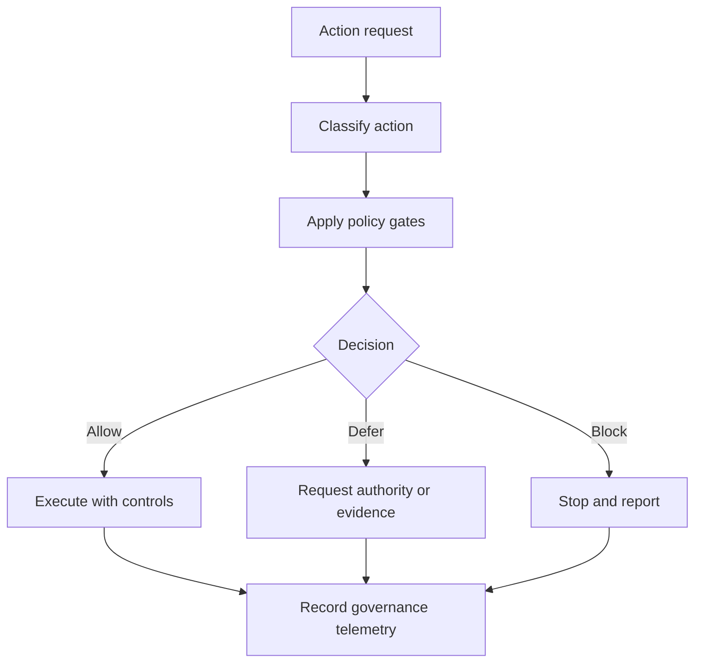

# Yellow-Control

Status: v0.1.3 clean architecture rebuild candidate.

Yellow-Control is a public-safe governance documentation repository for operating autonomous or semi-autonomous technical agents under human authority.

## Intended audience

- System administrators
- Cyber-security administrators
- DevSecOps/platform teams
- Hermes-compatible runtime maintainers

## What Yellow-Control is

- A public-safe governance model for delegated agent operation
- Policy-gate documentation for allow/defer/block decisions
- A Hermes-compatible skill structure for governance workflows
- Public register templates and fictional examples for repeatable governance operations

## What Yellow-Control is not

- Not a one-click Hermes installer
- Not an official Hermes/Nous Research skill unless accepted through official channels
- Not a place for private runtime data
- Not a replacement for human authority

## At a glance

| Area | Summary |
|---|---|
| Governance model | Uses ADAL/CDEL/ESAL/PCL concepts to classify actions and apply gates. |
| Safety posture | Requires explicit authority checks, backup/rollback discipline, and confidentiality boundaries. |
| Runtime alignment | Designed to be Hermes-compatible without claiming official endorsement. |
| Artifacts | Public docs, governance concepts, templates, and examples. |

## Documentation map

| Document | Purpose |
|---|---|
| [docs/index.md](docs/index.md) | Reading order, audience-specific paths, and status |
| [docs/architecture.md](docs/architecture.md) | Governance and classification flows, register relationships, extraction safety |
| [docs/concepts/adal.md](docs/concepts/adal.md) | Agent Delegated Administration Level |
| [docs/concepts/cdel.md](docs/concepts/cdel.md) | Container/Sandbox Delegation Level |
| [docs/concepts/esal.md](docs/concepts/esal.md) | External Service Authority Level |
| [docs/concepts/pcl.md](docs/concepts/pcl.md) | Project Confidentiality Level |
| [docs/concepts/authority-model.md](docs/concepts/authority-model.md) | Human authority, operator role, governed agent role |
| [docs/concepts/policy-gates.md](docs/concepts/policy-gates.md) | Gate logic, evidence requirements, allow/defer/block outcomes |
| [docs/registers/external-service-register.md](docs/registers/external-service-register.md) | Public-safe register structure for external services |
| [docs/hermes/skill-usage.md](docs/hermes/skill-usage.md) | Hermes-compatible governance skill usage guidance |

## Governance overview

## Community and contribution

Please use GitHub Issues for problem reports and Pull Requests for proposed changes.

## Authorship and AI assistance

Author: F.M. Robert Vergnes / robert.vergnes@yahoo.fr
Assisted-by: ChatGPT: GPT-5.5 Thinking; Codex; Hermes Agent v0.13
