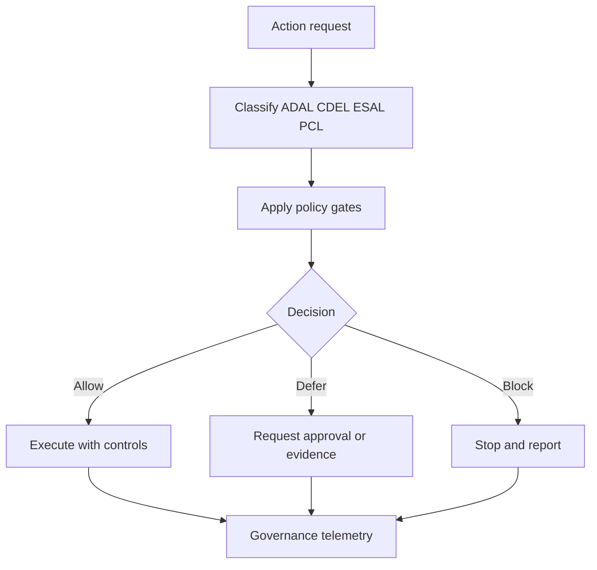

# Yellow-Control

Status: v0.1.3 clean architecture rebuild candidate.
Author: F.M. Robert Vergnes / robert.vergnes@yahoo.fr
Assisted-by: ChatGPT: GPT-5.5 Thinking; Codex; Hermes Agent v0.13

Yellow-Control is a public-safe governance layer for classifying authority, applying policy gates, and producing allow/defer/block decisions in Hermes-compatible workflows.

## What Yellow-Control is

- A governance model for authority classification with ADAL/CDEL/ESAL/PCL.
- Documentation for policy gates and backup/rollback controls.
- A public-safe external access register model and procedures.
- A Hermes-compatible skill structure that points to canonical governance docs.

## What Yellow-Control is not

- Not a one-click installer.
- Not an official Hermes or Nous Research artifact unless accepted upstream.
- Not a place for private runtime data or secret values.
- Not a replacement for human accountable authority.

## Target audience

- system administrators
- cyber-security administrators
- DevSecOps and platform teams
- Hermes-compatible runtime maintainers and reviewers

## Prerequisites and assumptions

- Hermes-compatible runtime already installed.
- Git available for branch and review workflow.
- Git hosting account available when automation requires repository actions.
- Fork and pull-request workflow is recommended.
- Backup and checkpoint capability exists before risky actions.
- Optional gateway and chat integrations may be used by local runtime operations.
- Optional external package management may exist as a separate layer.
- No private runtime data is stored in this public repository.

## At a glance

| Area | Summary |
|---|---|
| Governance model | Uses ADAL/CDEL/ESAL/PCL to classify actions and apply gates. |
| Core decision output | Allow, defer, or block with concise evidence. |
| External governance | External access is register-governed before privileged use. |
| Safety baseline | Backup and rollback gates are required before risky actions. |

## Governance overview

## Documentation map

| Path | Purpose |
|---|---|
| [docs/index.md](docs/index.md) | Reading order and role-based navigation |
| [docs/architecture.md](docs/architecture.md) | Core architecture and boundary diagrams |
| [docs/concepts/authority-model.md](docs/concepts/authority-model.md) | Human authority and delegation boundaries |
| [docs/concepts/adal.md](docs/concepts/adal.md) | Host and admin delegation levels |
| [docs/concepts/cdel.md](docs/concepts/cdel.md) | Container and sandbox delegation levels |
| [docs/concepts/esal.md](docs/concepts/esal.md) | External service access levels |
| [docs/concepts/pcl.md](docs/concepts/pcl.md) | Confidentiality and publication boundaries |
| [docs/concepts/policy-gates.md](docs/concepts/policy-gates.md) | Gate criteria and decision tables |
| [docs/concepts/backup-and-rollback.md](docs/concepts/backup-and-rollback.md) | Checkpoint and rollback governance |
| [docs/registers/external-access-register.md](docs/registers/external-access-register.md) | Core register schema for external targets |
| [docs/hermes/skill-usage.md](docs/hermes/skill-usage.md) | Skill usage in Hermes-compatible runtime |

## Quick start for reviewers

1. Read docs/index.md.
2. Read docs/concepts/policy-gates.md and docs/concepts/authority-model.md.
3. Inspect docs/registers/external-access-register.md and examples.
4. Inspect skills/yellow-control-governance/SKILL.md for concise behavior.

## Contributing

- Use scoped branches and reviewable commits.
- Keep public examples fictional.
- Keep one concept per file.
- Keep SKILL.md concise and move detail to docs references.

Community contact is through GitHub Issues and Pull Requests.
