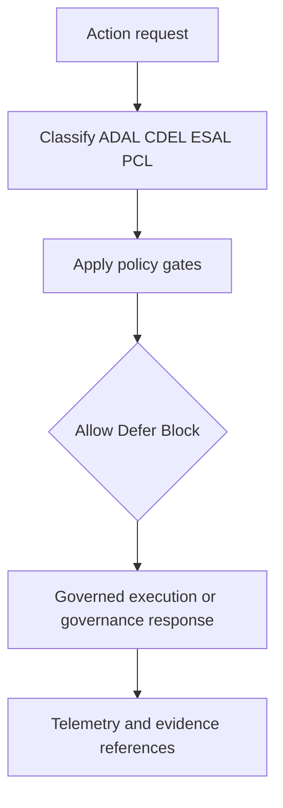
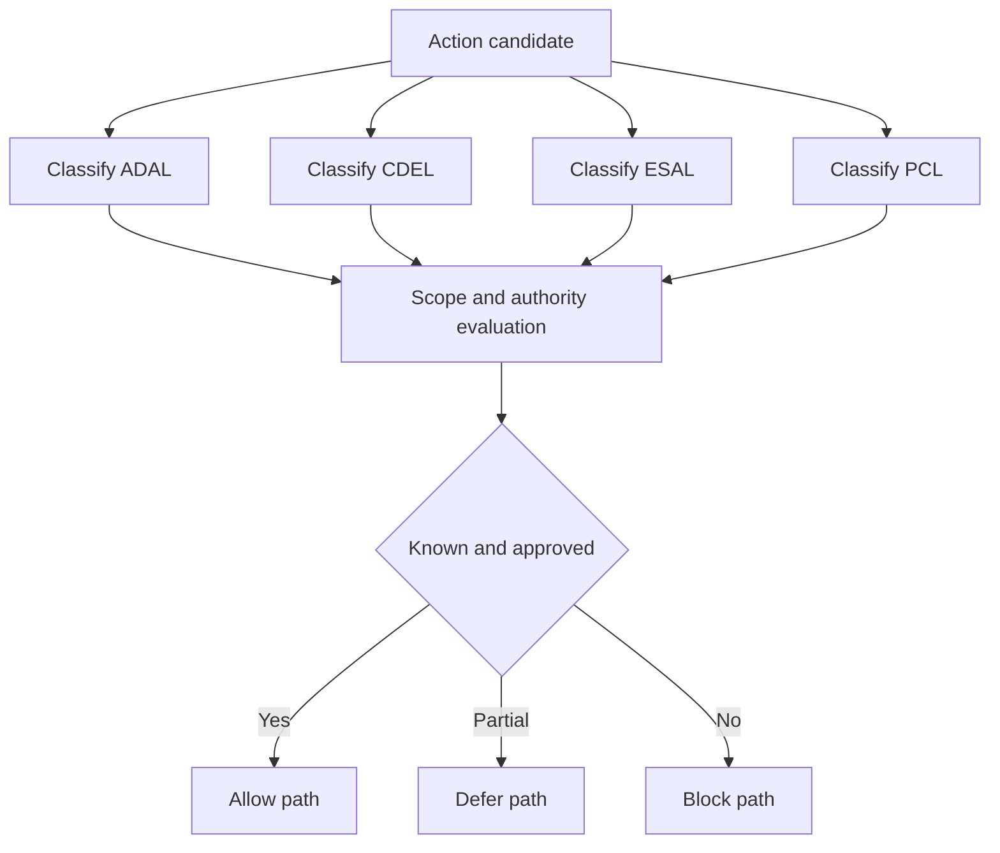
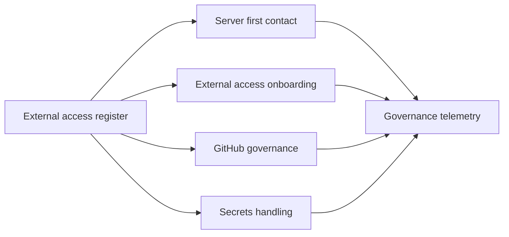
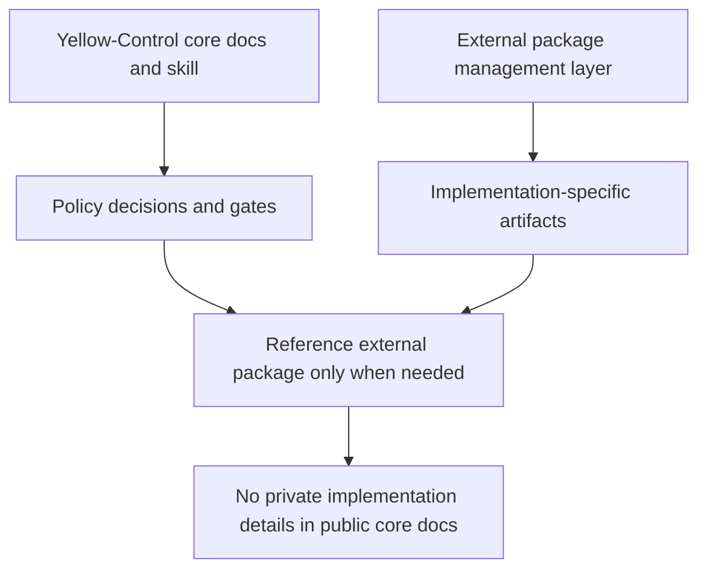

# Architecture

Status: v0.1.3 clean architecture rebuild candidate.
Author: F.M. Robert Vergnes / robert.vergnes@yahoo.fr

This architecture describes Yellow-Control core governance only.
External package management can be referenced as a separate layer, not merged into core doctrine.

## Core governance flow

## Classification and scope

## Register and procedure relationship

## Boundary with external package management

