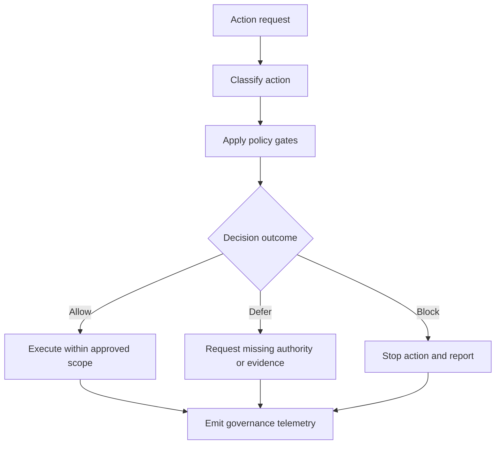
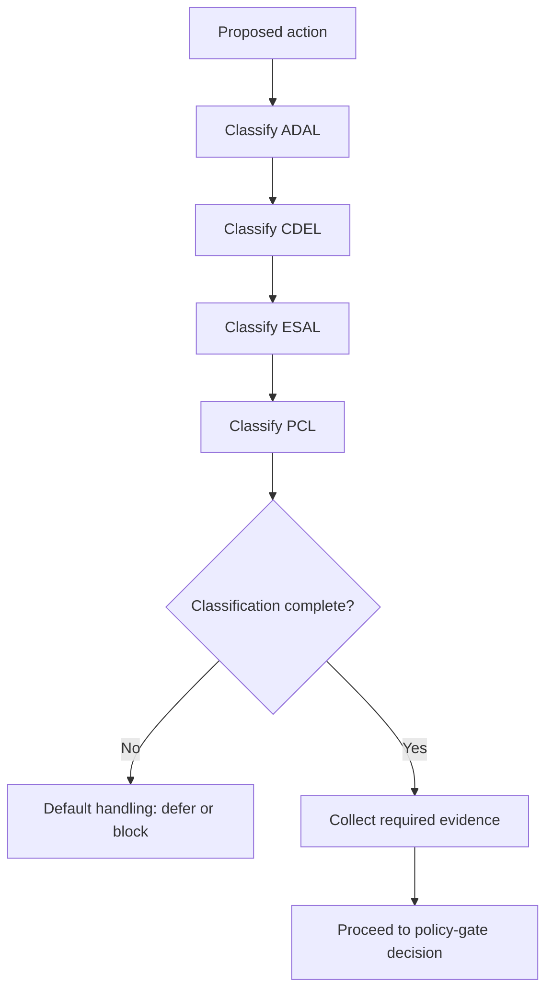
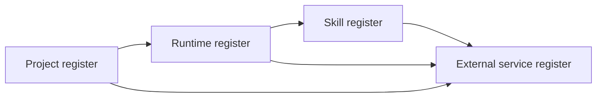
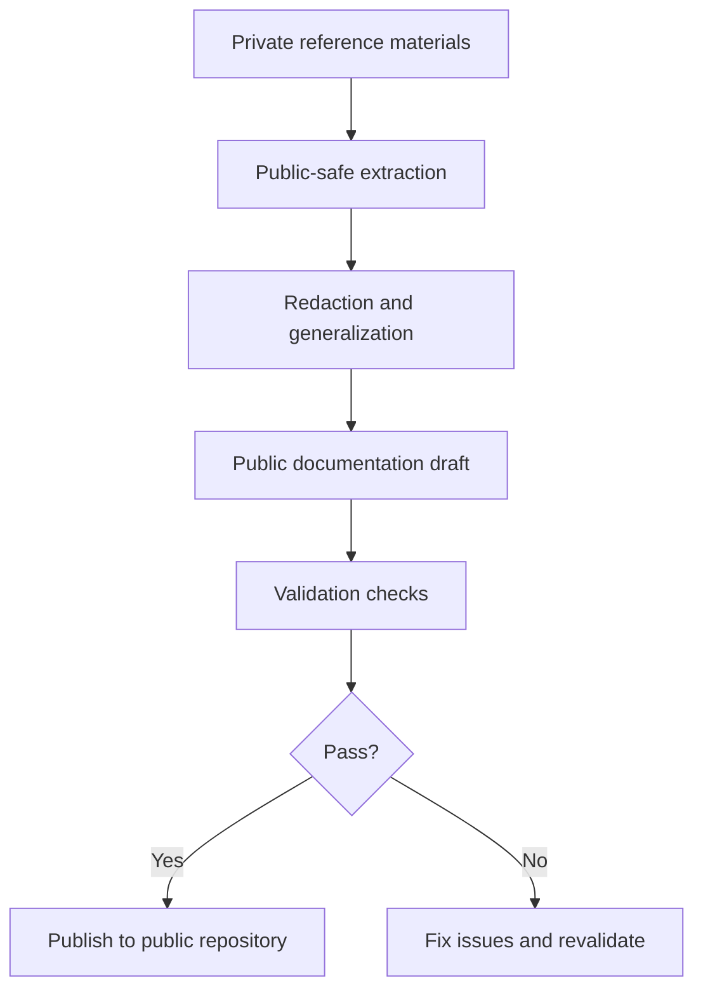

# Yellow-Control architecture

This document provides public-safe governance architecture views for decision flow, classification, register relationships, and private-to-public extraction safety.

## 1) Governance decision flow

## 2) ADAL/CDEL/ESAL/PCL classification flow

## 3) Register relationship diagram

## 4) Source-to-public extraction safety flow

Author: F.M. Robert Vergnes / robert.vergnes@yahoo.fr
Assisted-by: ChatGPT: GPT-5.5 Thinking; Codex; Hermes Agent v0.13
